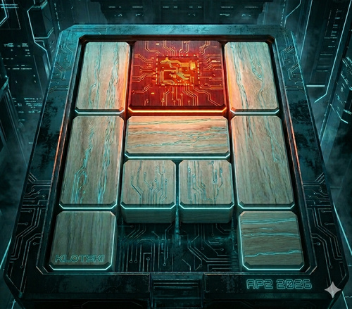
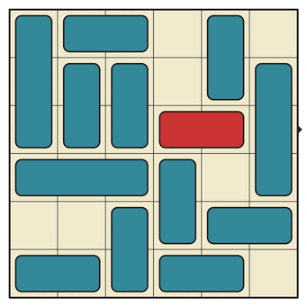
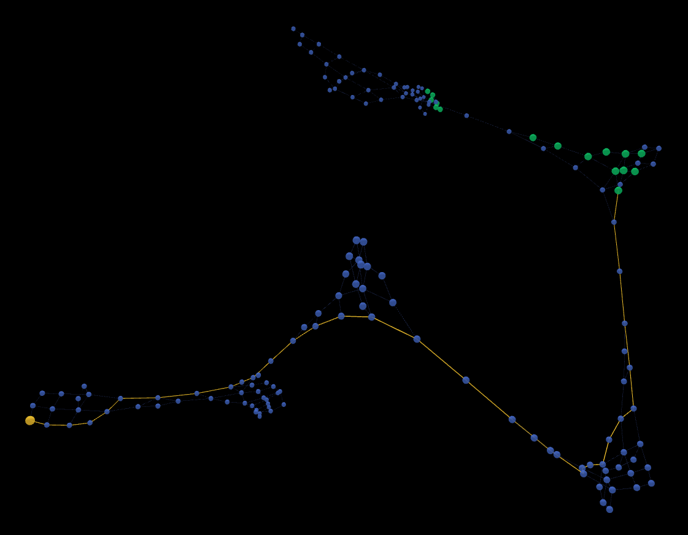

<p align="center">
  
</p>

# Klotski! (Pràctica 2 d'AP2, Primavera de 2026)

Posa a prova els teus coneixements de grafs resolent el clàssic
**[Klotski](https://en.wikipedia.org/wiki/Klotski)**! En aquesta
pràctica, dissenyaràs un algorisme que trobi la seqüència de
moviments necessària per resoldre aquest tipus de trencaclosques.
A més, podràs participar en una modalitat col·laborativa: crea
els teus propis reptes, resol els dels teus companys i valora les
millors propostes del curs.

En comptes de prohibir-la, la pràctica **_assumeix_ l'ús d'alguna
Intel·ligència Artificial de suport**. Tanmateix, l'alumnat es
considera 100% responsable de cada detall de la pràctica i, en
conseqüència, de qualsevol error ja sigui conceptual o en el
codi.

## Índex

- [Trencaclosques de peces lliscants](#sbps).
- [Objectiu de la pràctica](#goal).
- [Repositori de _puzzles_](#repo).
- [Preparació de l'entorn de treball](#prep).
- [Fases del projecte](#phases):
  - [Download](#download).
  - [Valorar _puzzles_ a partir del seu graf](#rate).
  - [Generació de _puzzles_ a l'atzar](#gen).
  - [Enviament de _puzzles_ nous](#submit).
- [Format estàndar d'un _puzzle_ de peces lliscants](#format).
  - [Preàmbul: canonicalització de _puzzles_](#canon).
  - [Format JSON d'un _puzzle_](#json).
  - [Entrega](#deliver).
- [Avaluació](#eval).
- [Llista de Tasques](#todos).
- [FAQ](#faq).
- [Referències](#refs).
- [Contribucions](#contrib).

<div id="sbps" />

## Trencaclosques de peces lliscants

En els "trencaclosques de peces lliscants", o _sliding block
puzzles_ (Klotski és potser el més famós), hi ha un taulell de
$N \times M$ caselles, i un conjunt de peces que ocupen aquestes
caselles. Les peces són de formes variades però sovint són
rectangulars, i es poden desplaçar pel taulell sense poder
solapar-se. A vegades també s'hi posen "parets", o sigui caselles
a les quals les peces no poden entrar. Les peces estan situades
en una posició inicial, i l'objectiu és moure una o més peces
objectiu (en un color llampant) fins a una posició final.

<p align="center">
  
</p>

La dificultat dels trencaclosques d'aquest tipus resideix en el
fet que per arribar a la posició final cal fer una sèrie,
potencialment molt llarga, de passos intermijos, que van movent
les peces secundàries per deixar passar la (o les) peces objectiu
fins a la posició final.

Tot i que en general els jocs com
"[Rush Hour](<https://en.wikipedia.org/wiki/Rush_Hour_(puzzle)>)"
han limitat les formes de les peces i han fet el taulell quadrat,
en aquest projecte farem una versió més oberta, i per encoratjar
la creativitat permetrem:

1. Que les peces tinguin **formes lliures** (però complint la
   definició dels
   [poliominós](https://es.wikipedia.org/wiki/Poliomin%C3%B3) de
   fins a tamany quatre).

2. Que hi pugui haver **parets**, és a dir, caselles que cap peça
   pot trepitjar o atravessar.

En l'aspecte del moviment de les peces, però, farem servir el de
model de Klotski, en el qual _les peces es poden moure lliurement
en qualsevol direcció_. El moviment a Rush Hour, per exemple, no
és lliure. Es fan servir cotxes com a peces precisament perquè
els cotxes només es poden moure en la direcció en la que apunten
les rodes, i no es poden desplaçar de costat.

> Amb el perdó de
> l'[Institut d'Estudis Catalans](https://www.iec.cat/), en
> aquest document, a partir d'aquest punt, farem servir la
> terminologia anglesa _puzzle_ per referir-nos als
> trencaclosques, per evitar que se'ns pugui trencar la closca
> intentant pronunciar (i escriure) repetidament aquesta bonica
> paraula.

<div id="goal" />

## Objectiu de la pràctica

L'objectiu de la pràctica és desenvolupar un programa que
contribueixi a la cerca col·laborativa de la següent manera:

1. Pugui descarregar un _puzzle_ d'un repositori compartit.
2. Creï el graf d'un _puzzle_ per analitzar-lo.
3. Resolgui un _puzzle_ fent servir el graf.
4. Valori els _puzzles_ existents fent servir mesures sobre el
   graf.
5. Envïi les valoracions dels _puzzles_ al repositori compartit.
6. Generi _puzzles_ a l'atzar i en triï els millors.
7. Enviï els millors _puzzles_ generats per tal que els valori la
   resta de participants en el projecte.

Si la col·laboració funciona bé, és molt possible que els puzzles
generats siguin notablement millors que els de molts jocs
comercials actualment al mercat. (Si fos el cas ja en parlaríem
🤑...)

<div id="repo" />

## Repositori de _puzzles_

Per poder fer la part col·laborativa, la pràctica té una
[web de suport](https://klotski.pauek.dev). Aquesta web permet:

- Veure (i obtenir un llistat de) tots els _puzzles_ disponibles
  en un moment donat.
- Descarregar un _puzzle_ (en format
  [`.json`](https://en.wikipedia.org/wiki/JSON)).
- Enviar la valoració d'un _puzzle_ (de 0 a 5 estrelles
  ⭐⭐⭐⭐⭐).
- Enviar un _puzzle_ nou.

Les operacions d'enviament de valoracions i nous _puzzles_
requereixen autorització, i la identitat de l'usuari/a que fa
l'enviament es determina mitjançant l'ús d'un _token_ (en
essència, una contrassenya a l'atzar llarguíssima). Aquest
_token_ serà distribuit a cadascú de forma individual, i l'haureu
de guardar en un lloc segur i no compartir-lo amb ningú.

Com veureu en [una propera secció](#format), el projecte defineix
un format estàndar pels _puzzles_, i aquest format és la base per
a la comunicació entre els diferents programes involucrats i el
repositori.

<div id="prep" />

## Preparació de l'entorn de treball

Aquest projecte utilitza eines professionals estàndard com `WSL`,
`Pixi` i `graph-tool`. No us espanteu pels noms; seguiu aquests
passos i ho tindreu tot llest en 15 minuts.

### WSL (només si esteu a Windows)

La llibreria d'anàlisi de grafs
[`graph-tool`](https://graph-tool.skewed.de/), és molt potent,
però només funciona nativament en Linux. Per solucionar-ho us
recomenem que, en comptes d'utilitzar una màquina virtual,
utilitzeu
[`WSL`](https://learn.microsoft.com/en-us/windows/wsl/about)
(Windows Subsystem for Linux).

1. Obriu el PowerShell de Windows com a administrador i escriviu:

```sh
wsl --install Ubuntu
```

Això instalarà WSL i la distribució de Linux Ubuntu. Pot trigar
força temps i ocupar molt d'espai (perquè conté una part
important de tots els programes d'una distribució d'Ubuntu).

2. Us demanarà un usuari i una contrasenya.

**⚠️ IMPORTANT**

- No useu l'usuari `root`. Trieu un nom normal (ex: el vostre
  nom).
- Recordeu la contrasenya, la necessitareu per instal·lar coses!
- Si no us ho demana, és possible que hageu fet alguna cosa
  malament (no obrir el Powershell com a administrador, usar el
  Powershell ISE...).

3. Per treballar còmodament, farem que VS Code "entri" dins del
   WSL:

- Instal·leu
  [l'extensió WSL a VS Code](https://marketplace.visualstudio.com/items?itemName=ms-vscode-remote.remote-wsl).
- A la pantalla principal del VSC, premeu el botó blau de baix a
  l'esquerra (`><`) i seleccioneu "**Connect to WSL**".
- Ara, obriu la terminal de VS Code (`Ctrl + ñ`). Hauríeu de
  veure un text tipus `usuari@nom-pc:~$`

### Instal·lació per Linux, MacOS i WSL

1. Oblideu-vos d'instal·lar Python, llibreries i configurar
   entorns virtuals a mà. Farem servir
   [`Pixi`](https://pixi.prefix.dev/latest/). Pixi és un gestor
   de paquets modern que descarrega automàticament tot allò que
   el projecte necessita (incloent-hi la versió correcta de
   Python i la llibreria `graph-tool`) sense embrutar el sistema.
   Si no el teniu ja, cal instal·lar Pixi escrivint a la
   terminal:

```sh
curl -fsSL https://pixi.sh/install.sh | sh
```

Tanqueu i torneu a obrir la terminal perquè el sistema reconegui
el nou programa.

2. Descarregueu (cloneu) aquest repositori i demaneu-li a Pixi
   que instal·li les dependències del projecte (que ja estan
   registrades a `pixi.toml`) amb:

```sh
git clone https://github.com/pauek/klotski.git
cd klotski
pixi install
```

### Com executar codi (Paràmetres i Terminal)

En aquesta pràctica, **NO** farem servir el botó de "Play"
(triangle) del VS Code per executar el codi. La majoria de
scripts necessiten saber quin fitxer de _puzzle_ han de llegir
(un paràmetre).

El codi proporcionat conté vàries utilitats per treballar amb els
_puzzles_. Hi ha una eina (un fitxer `.py`) per a cada cosa:

- Jugar a un _puzzle_: `src/play.py`.
- Crear la imatge de l'estat inicial d'un _puzzle_:
  `src/image.py`.
- Veure el graf d'un _puzzle_ en 3D: `src/3D_view.py`.
- Generar una pel·lícula (un `.gif` animat) de la solució d'un
  _puzzle_: `src/movie.py`.

La pràctica consisteix, precisament, en _extendre_ aquesta llista
d'eines i integrar correctament les noves eines que feu amb la
resta, fent servir els mateixos formats i fent `import`s del codi
d'altres utilitats quan sigui necessari per no duplicar.

La forma correcta d'executar cada utilitat és escrivint
directament la comanda al terminal. Primer, activeu l'entorn de
la pràctica:

```sh
pixi shell
```

Si tot surt bé a la terminal us hauria de sortir una cosa similar
a aquesta:

```bash
(Klotski) usuari:~/klotski$
```

El prefix entre parèntesis `(Klotski)` prové del nom del projecte
(que alhora prové del nom de la carpeta, per defecte), i ens diu
que l'entorn que hem instal·lat està actiu.

Ara ja podeu llançar els programes passant el _puzzle_ que
vulgueu:

Per jugar a un _puzzle_

```sh
python src/play.py puzzles/sample1.json
```

Per generar una imatge de l'estat inicial d'un _puzzle_:

```sh
python src/image.py puzzles/klotski.json
```

**Forma directa**: hi ha una forma equivalent de fer el mateix
que evita passar per `pixi shell` (que és com un intèrpret de
comandes modificat que utilitza l'entorn que s'ha instal·lat),
tot i fer la comanda una mica més llarga:

```sh
pixi run python src/play.py puzzles/klotski.json
pixi run python src/image.py puzzles/klotski.json
```

En el treball diari amb les eines, és molt necessari reutilitzar
aquestes comandes (perquè són molt semblants) i per tant és
aconsellable fer servir la fletxa amunt ⬆️, que en la majoria de
terminals permet reciclar les comandes que s'han escrit
anteriorment, editant-ne algunes parts.

### Consells per a Visual Studio Code

- **Intèrpret de Python**: Perquè el VS Code no us marqui errors
  en el codi, premeu `F1` -> `Python: Select Interpreter` i trieu
  el que està dins de la carpeta `.pixi/envs/default/bin/python`

- **Extensions**: Dins de la sessió de WSL, recordeu tornar a
  instal·lar les extensions de Python i Pylance pels _colorins_
  en l'editor i el tipatge (VS Code us ho demanarà en una
  bombolla blava). La raó d'això és que WSL és, des del punt de
  vista de Windows, un "sistema remot", i en el sistema remot no
  hi ha les extensions que teniu a Windows, perquè és com un
  altre ordinador.

<div id="phases" />

## Fases del projecte

El projecte podem dir que té les fases següents:

<div id="download" />

### 1. Descarregar _puzzles_

> **Eina**: `download.py`

El repositori es troba al servidor
[`https://klotski.pauek.dev`](https://klotski.pauek.dev), que
considerarem l'adreça base per totes les rutes explicades a
continuació.

El repositori té dos _endpoints_ o rutes desde les quals obtenir
la informació:

1. `GET /api/puzzles`: Fent una petició de tipus `GET` s'obté una
   resposta en format `.json` que retorna els identificadors dels
   100 puzzles amb votació més alta.

2. `GET /api/puzzles/[id]`: Fent una petició de tipus `GET` i
   substituint l'`ID` per l'identificador d'un _puzzle_, es
   retorna la representació en format `.json` del _puzzle_ amb
   aquell identificador.

Per fer proves, podeu fer servir una comanda com `curl` o `http`
i provar de connectar-vos i descarregar un puzzle al terminal, i
després fer-ho desde Python.

<div id="rate" />

### 2. Valorar _puzzles_ a partir del seu graf

<p align="center">
  
</p>

Per valorar un _puzzle_, cal programar la lectura del _puzzle_ en
el format estàndar, i generar el graf associat.

#### Definició del graf

> **Eina**: `graph.py`. Donat un _puzzle_, guarda el graf
> resultant. `graph-tool` permet guardar el graf en un fitxer
> `.graphml`, que facilita l'intercanvi amb les altres eines.

El **graf** es defineix de la següent manera. Cada node és una de
les diferents disposicions de les peces en el taulell, i dues
disposicions (dos nodes) estan connectades per una aresta quan es
pot passar d'una disposició a l'altra movent una sola peça.

A més, el _puzzle_ defineix com a estat inicial un dels nodes, i
com a estat final un altre node, típicament llunyà en el graf. En
realitat pot haver-hi molts nodes finals, ja que sovint la
condició d'acabament és situar una peça objectiu a una posició
concreta, condició que compleixen molts taulells alhora, per la
combinatòria de les posicions de les peces secundàries.

Per tant, una part de la programació consisteix en simular els
moviments en el taulell i esbrinar quins moviments són possibles
donada una disposició de les peces, i a quines altres
disposicions donen lloc. Fent una exploració completa amb un DFS
del graf definit per un _puzzle_, tenim l'espai de les
disposicions accessibles i quines estan connectades entre sí.

L'anàlisi d'aquest graf ens aporta potencialment molta informació
sobre l'estructura d'un _puzzle_, com ara: si és resoluble, el
número mínim de moviments necessaris per resoldre'l, si hi ha més
d'una solució, etc. I per altra banda, l'estructura del graf ens
diu altres coses, com si el _puzzle_ té "fases" (zones ben
connectades amb ponts que les connecten per camins amb un sol
node), o altres estructures.

#### Solució del _puzzle_

> **Eina**: `solve.py`. Resol el _puzzle_ donant lloc a un fitxer
> amb els moviments (vegeu el format a una secció més endavant)
> necessaris per moure peça a peça desde la posició fins arribar
> a la final.

Donat el graf, una part obligatòria del projecte és resoldre el
_puzzle_, utilitzant el graf.

#### Mesures al graf

> **Eina**: `eval.py`. Avalua un _puzzle_ donat en `.json`.

Una de les contribucions obertes del projecte és decidir quines
mesures sobre el graf permeten obtenir, en combinació, una
valoració entre 0 i 5 estrelles. La combinació de les mesures es
pot fer amb alguna fórmula _ad hoc_, de manera que la valoració
final es correspongui, encara que sigui subjectivament, a
_puzzle_ "interessants". Els criteris pels quals un _puzzle_ és
"interessant" són subjectius i no s'assumeix que n'hi hagi cap
d'estrictament millor que la resta.

#### Valoració col·laborativa dels _puzzles_

> **Eina**: `rate.py`. Donat un identificador de _puzzle_ del
> repositori, envia una valoració entre 0 i 5 estrelles.

Les valoracions de diferents usuaris per a un _puzzle_ concret
s'acumulen i donen lloc a una mitjana, que és la valoració
col·lectiva que es dóna a un _puzzle_. Quan un/a mateix/a
usuàri/a envia una nova valoració, se sobreescriu l'anterior.

Que les valoracions es puguin canviar permet a cadascú anar
millorant l'algorisme de valoració, i potencialment pot fer que
el rànking dels _puzzles_ més valorats vagi evolucionant en el
temps (si a millor o a pitjor ja depèn del grup sencer d'AP2 😉).

<div id="gen" />

### 3. Generació de _puzzles_ a l'atzar

> **Eina**: `generate.py`. Donats certs paràmetre (completament
> lliures), genera un nou _puzzle_ que guarda en un fitxer
> `.json`.

Per contribuir _puzzles_ nous, cal escriure també un generador a
l'atzar. Tanmateix, un generador que sigui completament a l'atzar
possiblement generi _puzzles_ interessants amb una probabilitat
massa baixa.

Aquí és on hi ha una altra potencial contribució, i és en fer un
generador que tingui restriccions suficients perquè es generin
_puzzles_ dins d'un subespai més petit i ja amb certes idees
preconcebudes sobre que augmentin la probabilitat de trobar-ne de
bons. Podeu fer inclús generadors diferents, de diferents classes
de _puzzles_, si cal.

Per poder enviar _puzzles_ nous al repositori, és convenient
valorar els _puzzles_ generats aplicant la valoració del punt
anterior, i així descartar _puzzles_ que no tinguin la qualitat
suficient, segons el vostre criteri.

<div id="submit" />

### 4. Enviament de _puzzles_ nous

> **Eina**: `upload.py`. Llegeix un _puzzle_ en format `.json` i
> l'envia al repositori, fent servir un _token_ per la
> autenticació.

Els _endpoints_ del repositori relacionats amb l'enviament són
els que requereixen l'ús d'un _token_, que distribuirem a cadascú
per separat, mitjançant el correu electrònic de la UPC.

1. `POST /api/puzzles/[ID]/stars`: Petició `POST` que inclou un
   ID, un token i una valoració (real entre 0.0 i 5.0).

2. `POST /api/puzzles`: Petició `POST` que inclou un _puzzle_ i
   un token (per autenticar l'usuàri/a). El _puzzle_ està en el
   format estàndar explicat més avall. El _puzzle_ s'afegeix a la
   llista.

**Límit global**: Quan hi ha més de 200 _puzzles_ diferents, per
evitar que s'acumulin, el que es fa és escollir a l'atzar un dels
_puzzles_ amb valoració més baixa i se substitueix per
l'enviament. D'aquesta manera el número màxim de _puzzles_ es
manté sempre igual o menor que 200.

**Com fer servir el token**: El _token_ per pujar _puzzles_ es fa
servir en un "header HTTP". En una petició HTTP, que és com un
formulari amb les dades que s'envien a un servidor, es poden
adjuntar "metadades", i això la llibreria `urllib.request` (de la
llibreria de Python) ens ho permet adjuntar si creem una petició
(`Request`) així:

```python
# Creem un objecte Request
enviades = '{ "cuchi": "cuchi" }'
token = "x1y2z3a4b5c6d7e8"
request = urllib.request.Request(
    "https://myserver.com",
    data = enviades,
    method = "POST",
    headers = {
        "Content-Type": "application/json",
        "Authorization": f"Bearer {token}", # <-- Aquí es posa el token
    }
)

# Fem la petició
with urllib.request.urlopen(req) as response:
    rebudes = response.read()
    ...
```

<div id="format" />

## Format estàndard d'un _puzzle_ de peces lliscants

<div id="canon" />

### Preàmbul: canonicalització de _puzzles_

Molts _puzzles_ aparentment diferents podrien ser, en realitat,
el mateix. Per aconseguir que cada taulell diferent només tingui
una representació possible, farem servir la ordenació de les
coordenades, les peces, les parets, els objectius, i finalment
els _puzzles_. Aquesta ordenació ens dóna un _puzzle_ "canònic",
o sigui, el representant únic de tots els _puzzles_ equivalent a
ell mateix.

**Ordenació d'una tupla**: una tupla amb valors `(a, b)` s'ordena
pel valor d'`a` i, per a les tuples amb el mateix valor d'`a`,
pel valor de `b`.

**Coordenades**: Les coordenades serveixen per indicar punts dins
d'un rectangle, i són una parella `(x, y)` de naturals (inclòs el
0). La coordenada `(0, 0)` sempre és la de dalt a l'esquerra (per
tant no hi ha `x`s o `y`s negatives). S'estableix l'ordenació
entre coordenades com l'ordenació de la tupla `(x, y)`.

**Peces**: Les peces són una llista de coordenades _relatives_ a
`(0, 0)`, ordenades segons l'ordre esmentat, i sense repeticions.
De nou la coordenada `(0, 0)` és la cantonada esquerra a dalt.
Les coordenades, a més de l'ordre, compleixen una condició més:
que la peça estigui el més a l'esquerra i el més amunt possible
(és a dir, que almenys una coordenada tingui un 0 a les `x`s i
almenys alguna tingui un 0 a les `y`s). Donades aquestes
condicions, una peça es pot identificar de forma única per la
llista de les coordenades relatives de les seves caselles.

Les peces tenen un ordre ben definit donat que es poden ordenar
lexicogràficament fent servir la seqüència de les seves
coordenades. En un taulell, cada peça té una posició, que es
correspon amb la seva cantonada esquerra-dalt, i a la que es
poden sumar les coordenades relatives per veure quines
coordenades absolutes ocupa.

**Parets**: Les parets són caselles del taulell que cap peça pot
ocupar. Es representen com una llista de coordenades absolutes,
ordenades i sense repeticions. Totes les coordenades de parets
han d'estar dins dels límits del taulell.

**Ordenació canònica de les peces**: Les peces d'un _puzzle_
s'ordenen per la tupla `(forma, posició_inicial)`. Primer es
comparen les formes (lexicogràficament per les seves coordenades
relatives), i en cas d'empat es comparen les posicions inicials.
Aquesta ordenació es fixa un cop al crear el _puzzle_ i defineix
els índexos de les peces, que no canvien durant la simulació.

**Estat**: Un estat del _puzzle_ és simplement la llista de
posicions de totes les peces, en el mateix ordre que les peces al
_puzzle_. Cada peça té identitat pròpia (com si tingués un
color), de manera que intercanviar dues peces amb la mateixa
forma dóna un estat diferent. L'estat inicial és part de la
definició del _puzzle_.

Separar el _puzzle_ del seu estat és convenient de cara a
estalviar espai quan es construeix el graf.

**Objectius**: Els objectius són una llista ordenada de parelles
`(i, pos)`, on `i` és l'índex de la peça objectiu i `pos` és la
posició que ha d'assolir. L'ordenació és la de la tupla
`(i, pos)`.

**Trencaclosques**: Un _puzzle_ es defineix per les dimensions
`W` (amplada) i `H` (alçada) del taulell, les parets, les peces
(formes), l'estat inicial, i els objectius. Si totes les parts
estan en l'ordre especificat, tenim el representant únic o
"_puzzle_ canònic".

<div id="json" />

### Format JSON d'un _puzzle_

Donat un _puzzle_ canònic, la seva representació en format JSON
es construeix així:

1. Les coordenades són arrays de dos enters: `[0,0]`, `[3,5]`,
   etc.
2. Les peces són llistes de coordenades relatives:
   `[[0,0],[0,1],[0,2]]`.
3. Les parets són una llista de coordenades absolutes:
   `[[1,2],[3,0]]`. Si no n'hi ha, és una llista buida `[]`.
4. L'estat inicial és una llista de posicions, una per peça, en
   el mateix ordre que les peces: `[[1,1],[0,0]]`.
5. Els objectius són una llista d'objectes amb l'índex de la peça
   i la posició final: `{"i":0,"pos":[0,0]}`.
6. Un _puzzle_ és un objecte amb 6 camps:
   `{"W":...,"H":...,"walls":[...],"pieces":[...],"start":[...],"goals":[...]}`.

Per exemple, si afegim indentació (espais i salts de línia) a un
_puzzle_ per veure'l millor, un exemple pot ser:

```json
{
  "W": 4,
  "H": 5,
  "walls": [],
  "pieces": [
    [
      [0, 0],
      [0, 1],
      [0, 2]
    ],
    [
      [0, 0],
      [0, 1],
      [1, 0]
    ]
  ],
  "start": [
    [1, 1],
    [0, 0]
  ],
  "goals": [
    { "i": 0, "pos": [0, 0] },
    { "i": 1, "pos": [2, 0] }
  ]
}
```

<div id="moves" />

#### Format dels moviments en un _puzzle_

> Necessari per a les eines `solve.py`, `movie.py` i,
> opcionalment, `3D_view.py`.

Donat un _puzzle_, una seqüència de moviments de les peces es pot
representar com una seqüència de parelles `(p, m)` on `p` és
l'índex de la peça en el _puzzle_, i `m` és un moviment en les 4
possibles direccions: `N`, `E`, `S`, `W` (nord, est, sud i oest).
En format JSON aquests moviments seran un array d'arrays de 2
caselles a on la primera és un enter i la segona un `string` que
representa la direcció de moviment:

```json
[[0, "W"], [1, "S"], ...]
```

La carpeta `puzzle` conté algunes de les solucions dels _puzzles_
d'exemple, amb extensió `.sol.json`.

<div id="deliver" />

## Entrega

L'entrega consisteix en la carpeta sencera combinant els fitxers
originals i els vostres fitxers, incloent _puzzles_ generats per
vosaltres, comprimida en un **fitxer ZIP i només ZIP**. L'entrega
serà pel Racó, i **no es permetran entregues fora de termini**,
esteu avisats!

Entre els fitxers entregats, es pot (i segurament serà
necessari), reescriure el `README.md` (no deixeu el text
original, que ja el tinc) per posar una explicació
[_telegràfica_](https://dlc.iec.cat/results.asp?txtEntrada=telegr%E0fic&operEntrada=0)
sobre les característiques més rellevants del vostre projecte. Si
el corrector comença a llegir el `README.md` de seguida ha de
tenir una idea de com corregir-lo per no deixar-se res important.

**‼️IMPORTANTÍSSIM‼️**: Donat que la generació Z (si és que sou
unes guineus!) està acostumada a tenir GBs i GBs de dades sense
ser-ne conscient, tampoc us adonareu que la carpeta `.pixi`
(oculta a Mac i Linux i el WSL) té un tamany de **1.3GB**, i
supera
["con altura"](https://www.youtube.com/watch?v=p7bfOZek9t4) el
llindar d'entrega del Racó. Entenc que us sembli absolutament
normal, però per a una persona nascuda al 1975 això és una
_aberració de proporcions èpiques_. Si us contesto de forma molt
maleducada i potencialment insultant quan m'envieu un email amb
"perquè no poc pujar l'entrega al Racó?", no m'ho tingueu en
compte,
[_of course I still love you_ ❤️](https://www.planetary.org/space-images/of-course-i-still-love-you)
.

No dic què cal fer per arreglar-ho per no insultar la vostra
intel·ligència.

<div id="eval" />

## Avaluació

L'avaluació és manual, humana, i la farà el professor `@pauek`.

L'avaluació té en compte, exclusivament, el mèrit tècnic, i no
pas el fet d'haver arribat a tenir un puzzle en primer lloc o en
el segon o en l'últim al repositori. El repositori és una forma
de motivació, de treball en equip, i en cap cas afectarà
l'avaluació directament.

Tanmateix, cuideu els següents aspectes:

- Qualitat del codi, i fidelitat a les pautes que mostra el codi
  d'exemple. Claredat per a una persona que llegeix el codi de
  nou. El fet de modificar els fitxers originals i organitzar-los
  d'altres maneres no és incompatible amb la premisa de qualitat.
  El codi ofert no es considera "el millor", només un dels
  possibles.

- Eficiència en els algorismes. Sigueu
  [Parsimònia](https://www.diccionari.cat/GDLC/parsimonia), i
  reflexió en les coses importants. (Un codi curt i clarivident
  és molt millor que un de llarg i inescrutable. Siguem deixebles
  d'[Occam](https://ca.wikipedia.org/wiki/Guillem_d%27Occam).)

- Originalitat i profunditat d'anàlisi en la mesura d'"interès"
  d'un _puzzle_. Demostració de la seva rellevància amb exemples.

Per sobre de tot, d'un projecte es transpira la feina que hi ha
al darrere, que no té res a veure amb el _volum_, sinó amb la
**qualitat**. En un món a on la IA pot fer la feina feixuga a
cost molt baix
([o potser no? 🤔](https://www.wheresyoured.at/the-subprime-ai-crisis-is-here/#the-subprime-ai-crisis-begins)),
el
[bon criteri](https://www.theatlantic.com/technology/archive/2025/06/good-taste-ai/683101/)
és la única cosa que importa, pràcticament.

<div id="todos" />

## Llista de tasques (per ordre)

- [ ] **Instal·lació** 🖥️: Instal·lar l'entorn i clonar el
      repositori.
- [ ] **Proves** 🧪: Provar les comandes amb algun _puzzle_ de
      mostra (`play.py`, `image.py`, `movie.py`, `3D_view.py`).
- [ ] **Programació** ⌨️: escriure `download.py` i descarregar
      _puzzles_.
- [ ] **Investigació** 🔍: Mirar el vídeo de `2swap` (a les
      referències). Un cop vist s'entén molt millor la idea del
      graf darrere de cada _puzzle_.
- [ ] **Programació** ⌨️: escriure `graph.py` per construir el
      graf d'un _puzzle_.
- [ ] **Programació** ⌨️: escriure `solve.py` per resoldre un
      _puzzle_. Comprovar la solució tant al `3D_view.py` com amb
      `movie.py`.
- [ ] **Investigació** 🔍: Catalogar els tipus d'algorismes que
      existeixen ja programats a `graph-tool`.
- [ ] **Investigació** 🔍: Visualitzar els grafs de _puzzles_
      existents i pensar formes de mesurar-ne propietats.
- [ ] **Reflexió** 🧘🏻‍♀️: pujar al pic d'una muntanya durant la
      posta de sol i meditar amb les cames creuades i, amb cada
      polze, tocar la punta del dit índex
      ([el polze dret amb l'índex dret i el polze esquerre amb l'índex esquerre](https://gist.github.com/pauek/d4ce640cf3c3229db9ccdc469fe6671e))
- [ ] **Programació** ⌨️: escriure `eval.py`, que implementa una
      forma de mesurar l'interès d'un _puzzle_, fent servir els
      algorismes de grafs de `graph-tool`.
- [ ] **Programació** ⌨️: escriure `rate.py` i pujar les
      votacions dels puzzles descarregats.
- [ ] **Programació** ⌨️: escriure `generate.py` per generar
      puzzles, tenint en compte els criteris d'"interès".
      Acumular alguns puzzles i validar-los manualment.
- [ ] **Programació** ⌨️: escriure `upload.py` per contribuir
      puzzles nous.
- [ ] **Programació** ⌨️: (opcional) escriure `rate_all.py` que
      descarregui tots els puzzles del repositori i en torni a
      enviar les valoracions. Això permetria tenir actualitzada
      la puntuació de tots els _puzzles_, segons en vagin
      apareixent de nous. Tenir un sol script que ho fa
      automàticament és una bona manera de poder contribuir a
      tenir un rànking ben curat de _puzzles_.

<div id="faq" />

## FAQ

- **P**: Què passa si canvio la forma de mesurar l'"interès" a
  mig projecte? \
  **R**: Cap problema. Simplement torna a enviar les valoracions
  de tots els puzzles presents i les noves valoracions
  sobreescriuen les anteriors. Aquí el `rate_all.py` val el seu
  pes en or.

- **P**: Per fer aquest projecte necessitem escriure milers de
  línies de codi??!?! \
  **R**: An absolut, cada eina (cada `.py`) és relativament
  simple i, pel fet d'utilitzar els algorismes de `graph-tool`,
  la part més tècnica no és gaire llarga.

- **P**: Corre el rumor que aquest projecte, en el fons, té un
  paral·lelisme difícil de negar amb un còmic de
  [XKCD](https://xkcd.com) titulat
  "[Nerd Sniping](https://xkcd.com/356/)" (descomptant primer la
  "masculinitat" de l'acudit, _of course_)? \
  **R**: No podem confirmar in desmentir aquest rumor.

<div id="refs" />

## Referències

Inspiració:

- "[I solved Klotski!](https://youtu.be/YGLNyHd2w10)", de
  [2swap](https://www.youtube.com/@twoswap), 22 d'Agost de 2025.

- "[Rush Hour](https://www.michaelfogleman.com/static/rush/)", de
  Michael Fogleman, Juny de 2018.

Trencaclosques tipus _sliding blocks_:

- "[Sliding Block Puzzles](https://puzzlebeast.com/slidingblock/index.html)",
  a PuzzleBeast.

<div id="contrib" />

## Contribucions

Humans:

- _Pau Fernández_ ([@pauek](https://pauek.dev)): idea original i
  programació.
- _Roberto Nsoni_: prototipat, programació, i instruccions
  d'instal·lació.
- _Jordi Cortadella_: idees i verificació.

LLMs:

- _Claude Code 4.6 Opus_: programació.
